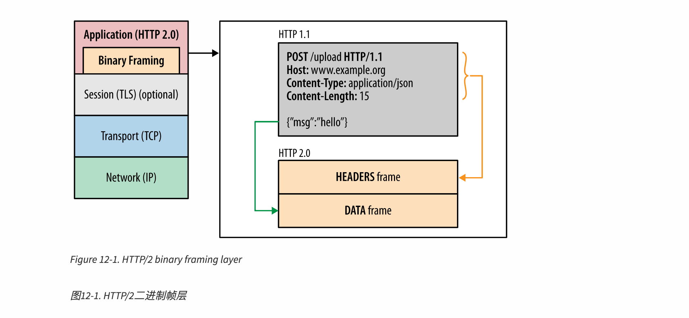
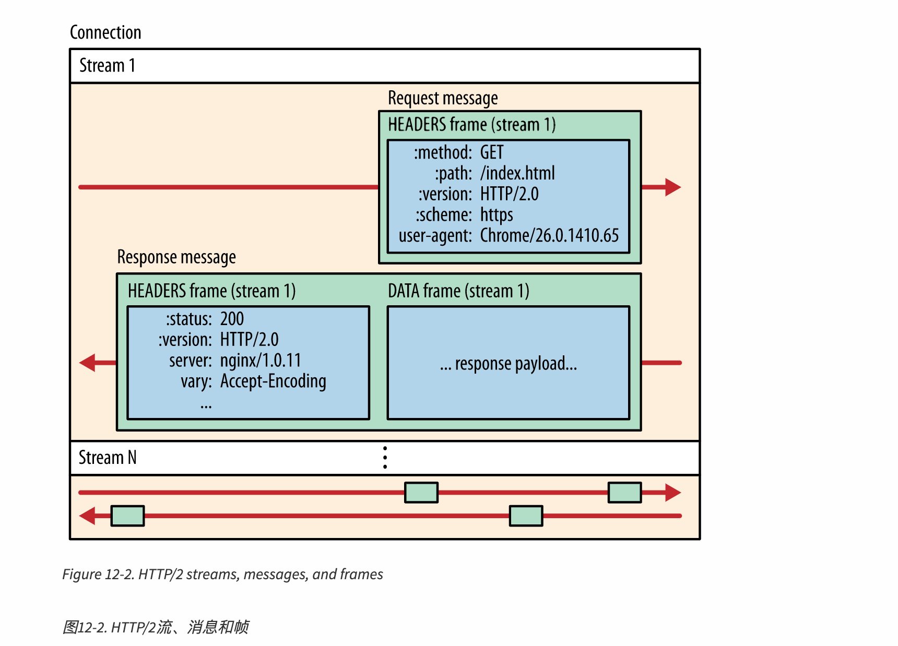
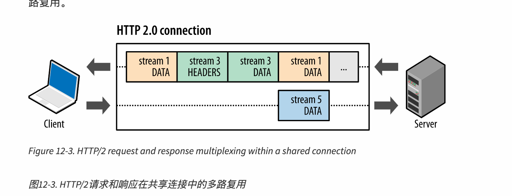
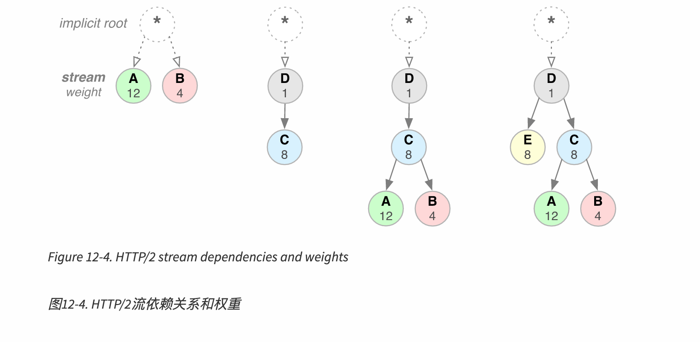
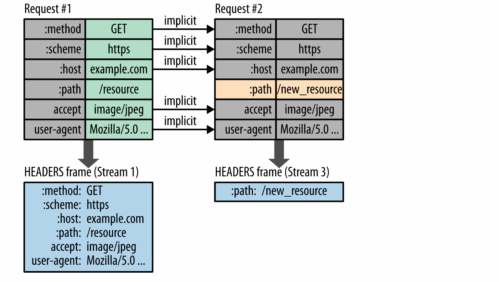

# HTTP2

## 为什么要有HTTP2?

HTTP2的存在采用了新的网络架构
1. 减小请求开销(有效压缩 HTTP 头字段来最小化协定开销)
2. 提升传输速度(支持多路复用)
3. 增加了对请求优先级的支持
4. 增加了服务器推送机制

HTTP2并没有改变HTTP的核心语义,比如说HTTP方法(POST,GET),状态码,URL和头字段等变化不大.
HTTP2主要的变化发生在了 客户端和 服务器之间的传输方式上,并不需要修改现有应用程序中的代码,就能进行切换.

> 为什么是HTTP2而不是HTTP/1.2?
> 因为HTTP2使用了二进制作为传输数据的数据格式,这种格式在HTTP/1.2中是不支持的,也就是说用HTTP1生成的请求数据是无法利用HTTP2进行发送的.
> 所以采用了新的版本号.

## HTTP2的历史

HTTP2以一个SPDY的项目为基础进行了演化,SPDY的目标是解决HTTP1.1中存在的一些问题:
1. allow concurrent requests across a single TCP connection, known as multiplexing; 
   
   允许请求夸TCP协议发送(多路复用)
2. allow browsers to prioritize assets so that resources vital to the display of a page could be sent by the server first; 
   
   允许浏览器对资产进行优先级排序，这样对页面显示至关重要的资源可以首先由服务器发送;
3. compress and reduce HTTP headers 压缩和减少 HTTP 报头
4. implement server push, whereby a server can push vital resources to the browser before being asked for them. 
   
   实现服务器推送(server push) ，即服务器可以在被请求之前将重要资源推送到浏览器。

HTTP2同样实现了以上功能,主要区别在于,HTTP2并不强制要求必须使用HTTPS链接(但是多数浏览器支持)

## HTTP2 意图解决什么痛点?

解决痛点:

HTTP实际上是在互联网诞生之初就存在的协议,在性能方面并没有经过良好的设计.


1. HTTP1不支持多路复用

比如一个TCP连接只能顺序发送HTTP请求,如果其中某一条HTTP请求出现延时,那么其后所有的HTTP请求都会被阻塞.

当然在实践中,我们会建立多个TCP连接实现了并发性,以缓解这个问题.但是建立TCP连接本身就是一个消耗资源的操作,并且其中的滑动窗口机制带来的慢启动,也会让很多链接并不能一开始就达到预期的速度.

为此,HTTP2采用了二进制帧作为最小单位,将HTTP1中的请求头+请求体切分成一个个的二进制包,在同一条连接中交替发送.

```
例子:
请求A 请求B 请求C
HTTP1
AAAAABBBBC
HTTP2
ABCABABABA
```
我们可以看到阻塞的问题不复存在.

2. HTTP1 的请求头并没有压缩,会导致不必要的网络流量
3. HTTP1 不支持优先级排序

HTTP1无论有什么资源都只能够顺序加载,假如说有一个24MB的图片和1KB的js文件,如果图片先被发送,那么js文件要一直等待,导致页面虽然显示了画面但是一直不能使用网页功能.

对于我们之前的例子，我们将获得一个 TCP 连接，传入的数据可能类似于 AABBCCAABBCC ,使 HTTP/2通常和 HTTP/1.1一样快，或者比 HTTP/1.1快一点，但是开销要小得多。

例子:

1 代表 图片 2 代表js文件
```
11111111111111111111122
```

而启用了优先级排序之后

```
22111111111111111111111
```

js会被优先传输.

> 当然事实上并非如此,优先级排序的表现在现实网络环境中的表现相当糟糕.

4. HTTP1 不支持服务器推送

假设一个客户端要请求浏览器,首先请求根目录`/`,服务器将`/`重定向到`/document.html`而后返回对应文件.但是当浏览器拿到`/document.html`的时候发现没有对应的css和JavaScript文件,页面显示不了,只好再次发送请求,去获取对应的css和JavaScript文件,服务器返回后页面才加载成功.

这是一个几乎所有新访问网站的客户的必有操作,而 HTTP2 做的事情就是将`/document.html`以及其配套的css和JavaScript文件预先推送到用户.

以下我们将具体讲解如上所说的这些功能,以及HTTP2是如何实现的.
## HTTP2 二进制帧

如上所说,HTTP2传送的数据格式不再是明文传输而是进行二进制传输,



二进制帧实际上是在TCP套接字和被程序调用的HTTP API 之间加入了一个中间层,HTTP方法,请求头等不受影响,但是HTTP请求将被切分为更小的以二进制编码的帧,再被TCP套接字发送.

当然这也意味着一个仅支持HTTP1的客户端向仅支持HTTP2的服务器发送请求时,服务器接到请求后会试图用二进制帧的方式理解这个请求,结果自然是失败的,反之亦然.
但是如果是如果一个HTTP1.1的服务端要升级到HTTP2,部署其上的博客程序并不需要逐个API的更改代码以适应HTTP协议的升级.

## HTTP2 Streams, Messages, and Frames 流、消息和 框架



HTTP2会在客户端和服务端在建立TCP连接后,会起数量任意的双向的流(stream),客户端和服务端所有的信息都会在这些流中传递.
HTTP请求会被切分为多个帧,用在流中传递消息,不同的HTTP请求的帧可以交替传输,通过每个HTTP请求独有的标识符,将交错传递的帧再服务端在拼成一个完整的HTTP请求.

多路复用:多路复用通常表示在一个信道上传输多路信号或数据流的过程和技术



我们可以看到在同一个连接上有三个流正在传输,客户端向服务器有一个stream5,服务器到客户端则有Stream1和3,同时有3个流在工作,其中分别传输着被切分成帧的请求.
这就是多路复用.

这样的好处:

1. 并行多个请求或响应而不阻塞任何一个请求
2. 通过多路复用使用单个链接同时传递多个请求或响应
3. 不会出现队头阻塞
4. 无需使用多个连接来实现并行请求

## HTTP2 优先级排序

优先级排序的好处已经解释过了,这里主要解释下优先级排序如何运行

优先级排序的最小单位是流. 每个流可以被分配一个1-256的权重数值.支持一个流对另一个流的强依赖.

流依赖关系和权重的组合允许客户机构造和通信一个“优先级树” ，该树表示它希望如何接收响应。反过来，服务器可以使用这些信息通过控制 CPU、内存和其他资源的分配来优化流处理，并且一旦响应数据可用，就可以分配带宽以确保向客户端提供最优的高优先级响应




依赖是依靠将一个流标识为它的父流来实现的,就像图中的D是C的根节点,那么D就是C的父流,它意味着尽可能在D完成响应之后才能响应C.而如果在优先级树上是兄弟节点,那么就到了权重数值的阶段了.

首先将整个层的权重相加,如图中A和B 就是12+4=16

而后将每个流的权重除相加后的值  A 12/16 B 4/16 以此算出每个流的权重.

然后以权重对资源进行分配,A将获得3倍与B的资源.

从左到右挨个树的解释


Neither stream A nor B specify a parent dependency and are said to be dependent on the implicit "root stream"; A has a weight of 12, and B has a weight of 4. Thus, based on proportional weights: stream B should receive one-third of the resources allocated to stream A.

流 A 和 B 都没有指定一个父依赖项，并且都被认为是依赖于隐式的“根流”; A 的权重为12，而 B 的权重为4。因此，基于比例权重: 流 B 应该获得分配给流 A 的资源的三分之一。

D is dependent on the root stream; C is dependent on D. Thus, D should receive full allocation of resources ahead of C. The weights are inconsequential because C’s dependency communicates a stronger preference.

D 依赖于根流; C 依赖于 D。因此，D 应该在 C 之前获得完整的资源分配。由于 C 的依赖性传达了更强的偏好，因此权重是无关紧要的。

D should receive full allocation of resources ahead of C; C should receive full allocation of resources ahead of A and B; stream B should receive one-third of the resources allocated to stream A.

D 应在 C 之前获得全部资源分配; C 应在 A 和 B 之前获得全部资源分配; 流 B 应获得分配给流 A 的资源的三分之一。

D should receive full allocation of resources ahead of E and C; E and C should receive equal allocation ahead of A and B; A and B should receive proportional allocation based on their weights.

D 应在 E 和 C 之前获得资源的全部分配; E 和 C 应在 A 和 B 之前获得平等分配; A 和 B 应根据其权重获得比例分配。


HTTP2提供了优先级排序这个功能,让开发人员可以使用这个功能让网页实现更加敏捷的加载体验.

要注意优先级排序功能并不具有强制性,比如D是C的父流,按照优先级排序的规定,D在完成响应之后才能响应C.但是如果D被阻塞,HTTP2并不会不响应C.
这在实际上是预期中的行为,高优先级流不能阻塞低优先级的流,防止因为某个资源阻塞,导致网页加载不出来,所以优先级排序功能并不是强制的.

实际上这个功能的表现依然糟糕....因为在真实的网络环境中,客户端和服务器之间存在大量的中间件(CDN,负载均衡,缓存....)这些东西的存在实际上让优先级排序大打折扣,甚至云服务商本身也不能让服务器实现优先级排序预期中的功能.


## HTTP2 只有一个链接

在HTTP1 时代为了提供并行加载的能力,将会在服务器和客户端之间建立多个TCP连接已实现并发性.

但是在HTTP2中HTTP1用TCP实现的多路流被Steam多路复用实现,那么也没有必要使用多个TCP连接了,相当于我们可以只使用一个不会频发中断的TCP连接,来传递多个HTTP请求.

HTTP请求的特点就是短而突发,TCP请求则相反无论是滑动窗口,慢启动,拥塞控制等都是面向长时间大数量数据进行设计.HTTP2通过长链接且支持多路复用的二进制流 来适配TCP的特点.

这将有效减少 TCP请求的数量,提升网络利用率.


## 头部压缩


HTTP/1.x 中，这些元数据总是以纯文本的形式发送，每次传输会增加500-800字节的开销，如果使用 HTTP cookie，有时会增加千字节的开销，参见测量和控制协定开销。为了减少这种开销和提高性能，HTTP/2使用 HPACK 压缩格式压缩请求和响应头元数据，这种压缩格式有两种特殊的能力:

1.  压缩,静态 Huffman 代码进行编码，从而减少了它们各自的大小.
2.  快速映射,HTTP两端都会维护一个MAP,其中可以记录 Huffman 编码并且直接映射为对应的明文字段


比如在Stream1中的请求让服务端的MAP种记录了method:GET scheme:https....等字段.当在Stream 2 中有一条path不同但是其他请求头字段完全相同的,那么它只需要解压缩 path字段了.


引文:

[http2](https://hpbn.co/http2/)