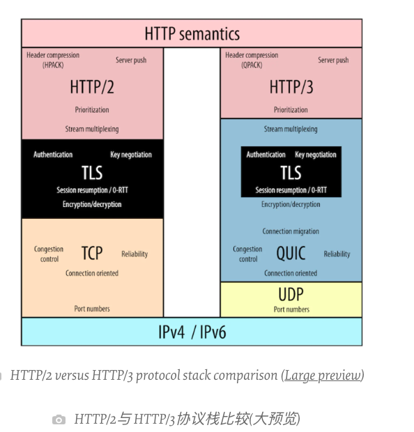
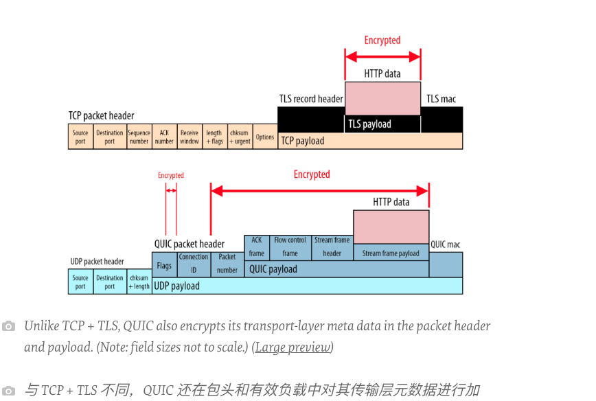
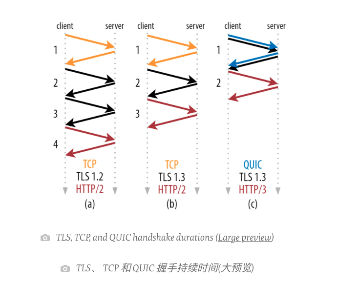
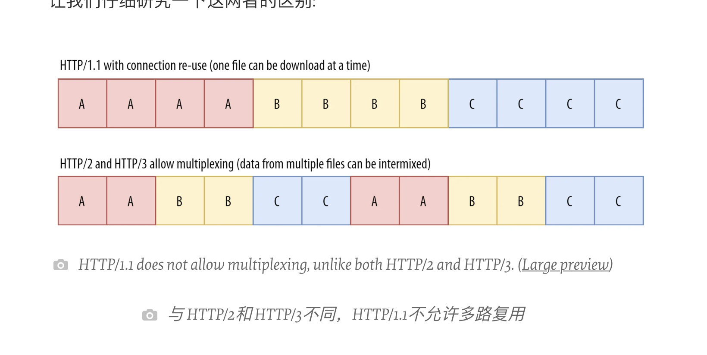
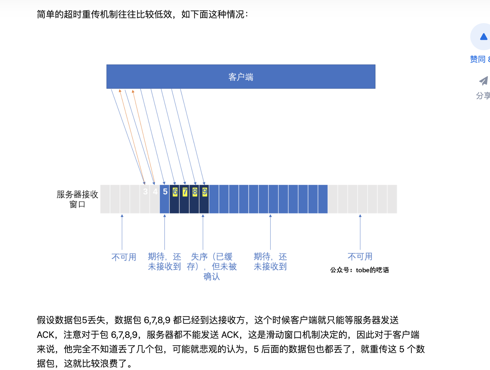
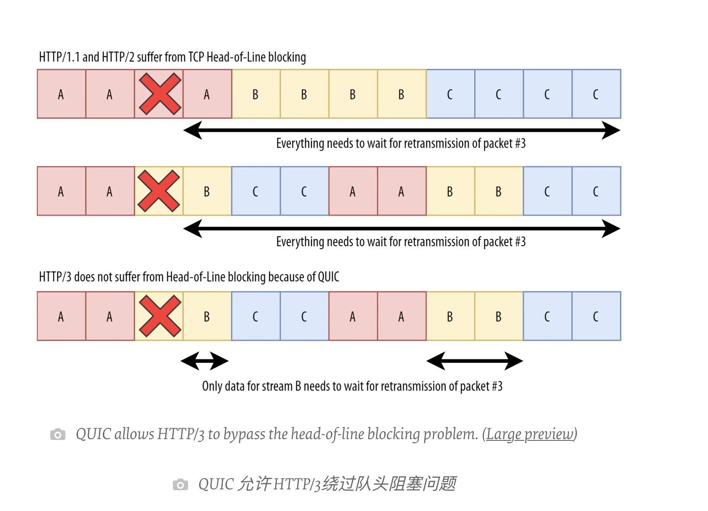

# HTTP3 

## 文章来源
[HTTP/3 From A To Z: Core Concepts](https://www.smashingmagazine.com/2021/08/http3-core-concepts-part1/)
文章共有三章


## HTTP2 一场性能革命?

HTTP2以一个SPDY的项目为基础进行了演化,SPDY的目标是解决HTTP1.1中存在的一些问题:
1. allow concurrent requests across a single TCP connection, known as multiplexing; 
   
   允许请求夸TCP协议发送(多路复用)
2. allow browsers to prioritize assets so that resources vital to the display of a page could be sent by the server first; 
   
   允许浏览器对资产进行优先级排序，这样对页面显示至关重要的资源可以首先由服务器发送;
3. compress and reduce HTTP headers 压缩和减少 HTTP 报头
4. implement server push, whereby a server can push vital resources to the browser before being asked for them. 
   
   实现服务器推送(server push) ，即服务器可以在被请求之前将重要资源推送到浏览器。

HTTP2同样实现了以上功能,主要区别在于,HTTP2并不强制要求必须使用HTTPS链接(但是多数浏览器支持)

[引文 为 HTTP2做好准备: Web 设计者和开发者指南](https://www.smashingmagazine.com/2016/02/getting-ready-for-http2/)

也正是因为如上这些全新的能力,HTTP2被视为一场性能革命,但是实际上出现了较为尴尬的情况,这些令人振奋的功能并不是都有效.

### HTTP2 PUSH

[2020年11月Google宣布移除HTTP2 PUSH](https://groups.google.com/a/chromium.org/g/blink-dev/c/K3rYLvmQUBY/m/vOWBKZGoAQAJ?pli=1)

没错,这个功能已经被移除了.

在这里要先举一个小栗子:

假设一个客户端要请求浏览器,首先请求根目录`/`,服务器将`/`重定向到`/document.html`而后返回对应文件.但是当浏览器拿到`/document.html`的时候发现没有对应的css和JavaScript文件,页面显示不了,只好再次发送请求,去获取对应的css和JavaScript文件,服务器返回后页面才加载成功.

这是一个几乎所有新访问网站的客户的必有操作,而 HTTP2 做的事情就是将`/document.html`以及其配套的css和JavaScript文件预先推送到用户.

这听起来非常棒.

但是有一个问题,服务端其实并不知道客户端是否存在缓存,而且对于缓存的数据是否齐全也不是很了解(例如:页面加载需要 html 文件,css 文件, js 文件.但是因为网络原因js文件在之前没有推送成功,页面加载不出来.),这也意味着每次用户访问新页面都需要进行PUSH操作,保证用户页面加载成功.

随着这个问题听起来十分容易解决,实际上也确实有`Cache Digest 标准提案`想要意图解决这个问题,但是并没有多少浏览器支持这个提案,并且其本身设计也有一个问题,为了标识用户已经缓存的文件,其用以标识的标识位实际上变成了一个`Super Cookie`,会导致安全问题.

[引文 Chrome to remove HTTP/2 Push](https://www.ctrl.blog/entry/http2-push-chromium-deprecation.html)
实际上还有更多问题
1. 不同的浏览器对于HTTP2 PUSH的支持度不同,比如Edge和Safari都有一定的问题,并且除了Chrome之外,其余的浏览器基本不提供devtools.
2. HTTP2 PUSH的文件并没有类似于HTTP的缓存一样的超时机制(max-age字段),如果推送匹配,那么即使缓存的是旧版的文件,依然会使用旧版文件.
3. HTTP2 PUSH推送的文件是独立进行缓存的,并不和HTTP的缓存使用同一个缓存.当用户第一次访问页面的时候,在请用户请求之前(没有任何缓存生成的时候)HTTP2 PUSH的缓存就已经出现了.这看起来不错,但是当HTTP的缓存中有和HTTP2 PUSH的缓存一样的项目的时候,优先使用HTTP缓存中的项目.在所有的缓存中HTTP2 PUSH的缓存是优先级是最低的.
4. HTTP2 PUSH的缓存依赖于HTTP2链接,如果在一个网络很糟的地方,链接会被频繁中断,HTTP2 PUSH的缓存就会被频繁清除,即使已经缓存成功也是如此.举个小栗子: 节点A访问站点B,HTTP2 PUSH发送,节点A将PUSH中的文件防到PUSH的缓存中,但是HTTP2 的请求报了404,同时链接被中断,节点A刷新页面,再次发送请求,此时之前那个链接的PUSH缓存已经被清除,所以需要重新在推送一遍.
5. 推送缓存中的项只能使用一次,也就是说当一个页面A使用了PUSH缓存中的文件A之后,那么文件A就会被删除.当然,可以将PUSH缓存移到HTTP的缓存中解决这个问题.
其实还有很多...

[引文 HTTP/2 PUSH的其他问题](https://jakearchibald.com/2017/h2-push-tougher-than-i-thought/)

### HTTP/2 优先级推送

实际上优先级推送也是较为失败的,虽然大部分云服务厂商都承诺提供优先级推送功能,但是实际上的表现不尽如人意.
相当一部分云服务厂商并没有让高优先级的图片比其他的低优先级图片被更优先推送.

[优先级现状](https://github.com/andydavies/http2-prioritization-issues)

### 结论

当有了如上的情况之后,有些时候我们应该意识到不应该对协议有太多不切合实际的推荐.

## HTTP3 我们为什么需要它？

实际上距离在大规模宣传HTTP2还没有过去特别长的时间（2015），我们为什么需要HTTP3？

对于这个问题，我们的结论是其实这是一开始就已经决定的。



当你看到HTTP2和HTTP3的架构图时你就会发现，HTTP2是在TCP上的，HTTP3却是架设在QUIC上的，所以如果说为什么要HTTP3，是因为我们需要在底层替换掉TCP协议，并且将HTTP2中的一些新功能平移到HTTP3上。

网络模型是分层的，HTTP 1.1/2/3 与TCP并不在同一层中，这也意味着下层协议实现的功能不需要在顶层协议中在实现一次，比如HTTP协议中就没有三次握手的相关概念。

但是这并不意味着 可以实现切换底层协议而上层协议无法感知，实际上HTTP2并不能在QUIC上运行，需要相应的适配。

这也就是为什么需要HTTP3.

当然现在还有一个问题

### 我们为什么要换掉TCP？

TCP是一个已经存在了30年的协议，它出现的时候并没有今天的互联网，其目的也仅仅是让互联网可以实现正常工作。
有两个主要的问题依然没有解决

1. TCP的握手导致了额外的性能开销，如果客户机和服务器距离较远，那么将会有延迟
2. 单个TCP将它传输的所有数据视为单独的文件，传输多个文件时，如果在传输时位于首位的文件出现丢失数据或者延迟，那么剩下的其他文件也不能执行，这个被称为 队首阻塞 `head-of-line (HoL) blocking`

这些问题在实践中也许不是问题（我们已经靠一些方式解决了相关问题: 域分片解决问题2 CDN解决问题1），但是对于HTTP协议来说，这些问题

> 推荐文章
> [凤凰架构](http://icyfenix.cn/architect-perspective/general-architecture/diversion-system/transmission-optimization.html)
> [解决HTTP队头阻塞](https://juejin.cn/post/7089438618372030501)
> [Head-of-line (HOL) blocking in HTTP/1 and HTTP/2](https://engineering.cred.club/head-of-line-hol-blocking-in-http-1-and-http-2-50b24e9e3372)

这些问题也许可以靠TCP升级进行解决，
也确实有相关的TCP升级版协议出现,但是这件问题真正的卡点在于我们无法升级互联网中的所有设施,在互联网中对于客户端和服务器端的更新是相对简单的,因为我们可以考程序进行自动升级或者手动升级.但是对于在客户端与服务器端之间的负载均衡,CDN,缓存服务器,防火墙等却无法轻易的更新.

如果想要升级这些东西,实际上需要消耗大量的时间.

## QUIC 是什么?

QUIC是传输层协议,但是基于UDP进行实现的.如果QUIC是个全新的协议,那就要在全网机器上大规模的部署,耗时太长,但是如果是基于UDP,因为大部分机器都支持UDP,实际上升级并不需要多么费劲.

QUIC同样实现了TCP的功能,QUIC支持数据校验并进行重传,需要建立连接,并且有了更加复杂的握手程序.
并且同样实现了流量控制[流量控制](https://www.rfc-editor.org/rfc/rfc9000.html#name-flow-control)和[拥塞控制](https://www.rfc-editor.org/rfc/rfc9002.html),防止发送方或者接收方超载.

### QUIC的变化.

#### QUIC与TLS深度集成

在之前TLS协议实际上直接运行于TCP之上,两者是完全分离的,而QUIC和TLS是包含的关系.



因为两者分离,所以TCP运载了被TLS加密的数据,TCP的header是未被加密的.而QUIC除了一些必要的暴露的数据,其余数据都被加密了,无论是载荷(palLoad)还是header.

折让QUIC有了以下优势

1. QUIC是更安全的,因为你没有办法以明文运行QUIC.
2. QUIC建立连接会更快,因为QUIC在握手的时候就已经开始了加密,节省了往返时间



HTTP2可以明文运行但几乎没有浏览器支持.

在客户机和服务器之间TLS也需要通过类似于TCP的握手一样的操作,进行协商的，这种协商可能需要一些时间。

TLS 1.3 之所以比 TLS 1.2 少了一次,因为TLS 1.3严格限制了可协商的不同数学算法的数量(最安全的算法)。这意味着客户机可以立即猜测服务器将支持哪些列表，而不必等待显式列表，从而节省往返时间

因为QUIC包含了TLS,所以可以在握手的同时进行TLS的写上,可以看到是有大量的性能节省的.

3. QUIC可以更容易的升级

这当然是一种好处,但是似乎也有代价,因为完全的加密所有的中间件都不能任意的对连接进行独特的定制.所以可以进行随意的升级.


#### 支持多个独立的字节流

HTTP2有类似的功能,多路复用.QUIC则是在传输层实现这个功能.

在HTTP1.1时,如果有三个文件A,B,C一般会开三个TCP连接,这会导致过大的开销,在文件数超过TCP连接数时还会导致队首阻塞.

为了解决,HTTP2实现了多路复用.

对于我们之前的例子，我们将获得一个 TCP 连接，传入的数据可能类似于 AABBCCAABBCC ,这看起来非常简单，而且确实工作得非常好，使 HTTP/2通常和 HTTP/1.1一样快，或者比 HTTP/1.1快一点，但是开销要小得多。



在图中看起来两者消耗的时间是一样的.

但是请考虑如下情况 一个 1kb的css 文件和一个 1MB的 js文件.

按照理论上来讲我们应该优先加载css以让用户看到页面而后在加载js文件.

如果在HTTP 1.1 如果恰好js先加载就是如下情况

1 代表 js 2 代表css
```
11111111111111111111122
```

而启用了多路复用之后

```
12121111111111111111111
```

明显css会先展示.


但是**这是传输层实现的**,TCP是无法感知到HTTP的数据的.

先复习一下[TCP重传](https://zhuanlan.zhihu.com/p/101702312)



如果传递了A,B,C三个文件,其中A,B较小,发送成功了,但是B有一个数据包丢失了,TCP并不知道AB已经发送成功(因为TCP不能感知到上一层的数据).所以整块数据都会被重新传输.(TCP是在操作系统内核中实现的,根据操作系统内核不同也可能不整块重传.)

QUIC实现独立的字节流就是为了解决这个问题



QUIC能感知到文件A文件B文件C属于不同的字节流,如果文件B出现丢包,需要重传,那并不会影响已经收到的文件A和文件C.

文章之初讲到,HTTP3实际上将基于TCP的HTTP2上的功能迁移到基于QUIC上的HTTP3上.

HTTP2上有多路复用,QUIC上有字节流,两者实际上的功能是冲突的.所以对于HTTP3来说,HTTP2上的多路复用被删除了.

这也意味着QUIC对于HTTP2的其他功能有一些相关的影响.`server push`, `header compression`, and `prioritization are implemented`


#### QUIC 支持连接迁移(QUIC使用连接ID)

QUIC支持


#### QUIC使用帧


