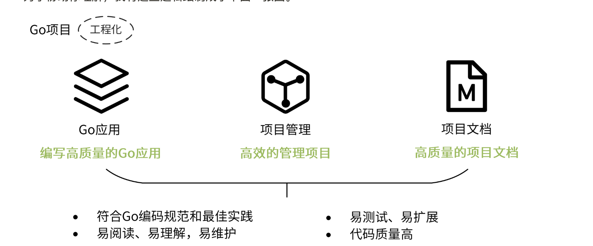
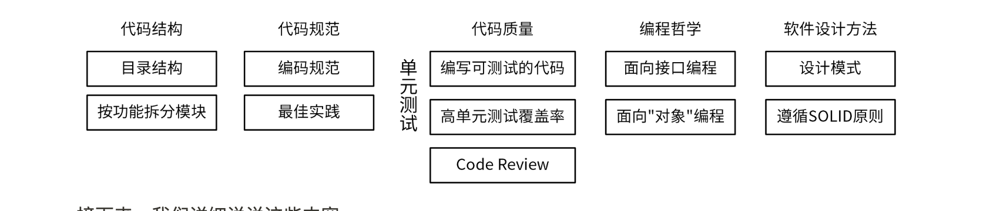
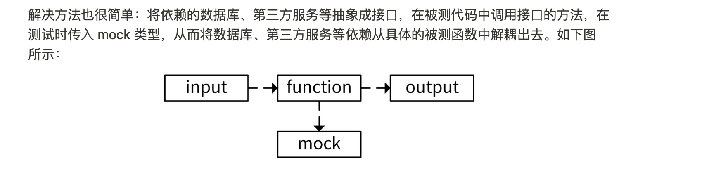

# 设计方法:如何写出优雅的GO项目


[如何写出优雅的Go项目](https://jewel-drawbridge-9fe.notion.site/10-Go-a14d88c1b7db41319e31d7d01f01e46f#6a7cf891e4dc471193f8e1a5fe98be10)

## 目录


## 编写高质量的GO应用



### 代码结构

代码结构有两种主要的拆分方法**按层拆分**和**按功能拆分**

**按层拆分**比较致命的就是java Spring框架中的MVC机制.
- View（视图）是提供给用户的操作界面，用来处理数据的显示。
- Controller（控制器），负责根据用户从 View 层输入的指令，选取 Model 层中的数据，然后对其进行相应的操作，产生最终结果。
- Model（模型），是应用程序中用于处理数据逻辑的部分。

在java中这个当然可以很好的运行,但是在Golang中却需要注意
`import cycle not allowed`循环引用报错.

当我们在 `Controller`包引用了一个`Service`层的函数,但是`Service`层有需要用到`Controller`包中的数据,这个时候就会出现循环引用报错.

循环引用报错的排查有些时候并不轻松,所以如果频繁出现这种问题实际上还是蛮难受的.

**按功能拆分**

现在我司使用的就是按功能拆分的方式.

假设服务中有三个功能

用户系统 User

订单系统 Order

计费系统 Billing

我们的模式更类似于如下的方式
```
- handler <--- 代码生成器自动生成
    - User    <--该包下的内容不会被除了代码生成器的其他逻辑所更改
    - Order
    - Billing
- logic
    - User
    - Order
    - Billing

```
虽然依然有展示层的概念,但是实际上我们通过代码生成器和CodeReview保证了handler层不会引用logic层中的内容.

而我们的无论是数据处理,还是业务逻辑都存放logic层中,通过这样的方式实现功能的划分.

相较于按层拆分，按功能拆分模块带来的好处也很好理解：

- 不同模块，功能单一，可以实现高内聚低耦合的设计哲学。
- 因为所有的功能只需要实现一次，引用逻辑清晰，会大大减少出现循环引用的概率。

### 代码规范

代码规范专门写了一篇文章.

### 代码质量

代码质量主要由 Code Review 和 代码单测来解决

**单元测试**是经常被忽略的部分.

单元测试的核心是要编写单元测试用例,而且要保证这些单元测试用例是可以重复执行的.

但是单元测试环境有以下几个特点:
1. 无法连接数据库
2. 无法连接第三方服务

其解决方案也相对简单.



当然,单元测试并不是只存在于自测阶段,实际上在程序设计时就需要考虑到我们写的代码必须要支持单元测试.

这里要说到一些Code Review方面的规范.

> 不要在API的实现者端去定义接口,这样会导致在写单测的时候无法使用原有API进行单测,无法设计自测函数.

如下代码其实就是不可测试的,我们在本地跑这份代码的时候是可以执行的,(前提是你的开发环境支持本地部署).但是当你将它提交到代码中,放到CI中跑的时候,因为没有CI环境并不存在相关的服务,所以不能执行.

即使CI中可以通过某些方法让其可以成功调用,但是第三方服务返回的数据并不是会永远一致.所以也许某一天,原本通过的CI就不再通过,如果恰好你的项目的合入限制中配置了 单测覆盖率的要求,那这样的结果将是灾难性的.
```go
package post
import "google.golang.org/grpc"
type Post struct {
  Name    string
  Address string
}
func ListPosts(client *grpc.ClientConn) ([]*Post, error) {
  return client.ListPosts()
}

```
如果使用如下方式,我们完全可以实现一个专用于mock的接口.

```go
package main
type Post struct {
  Name    string
  Address string
}
type Service interface {
  ListPosts() ([]*Post, error)
}
func ListPosts(svc Service) ([]*Post, error) {
  return svc.ListPosts()
}

```
实现如下

```go
package main
import "testing"
type fakeService struct {
}
func NewFakeService() Service {
  return &fakeService{}
}
func (s *fakeService) ListPosts() ([]*Post, error) {
  posts := make([]*Post, 0)
  posts = append(posts, &Post{
    Name:    "colin",
    Address: "Shenzhen",
  })
  posts = append(posts, &Post{
    Name:    "alex",
    Address: "Beijing",
  })
  return posts, nil
}
func TestListPosts(t *testing.T) {
  fake := NewFakeService()
  if _, err := ListPosts(fake); err != nil {
    t.Fatal("list posts failed")
  }
}

```

# TODO
这里要专门展开一下如下几个测试包的使用方式
- [golang/mock](https://github.com/golang/mock)：是官方提供的 Mock 框架。它实现了基于 interface 的 Mock 功能，能够与 Golang 内置的 testing 包做很好的集成，是最常用的 Mock 工具。golang/mock 提供了 mockgen 工具用来生成 interface 对应的 Mock 源文件。
- [sqlmock](https://github.com/DATA-DOG/go-sqlmock)：可以用来模拟数据库连接。数据库是项目中比较常见的依赖，在遇到数据库依赖时都可以用它。
- [httpmock](https://github.com/jarcoal/httpmock)：可以用来 Mock HTTP 请求。
- **[bouk/monkey](https://github.com/bouk/monkey)**：猴子补丁，能够通过替换函数指针的方式来修改任意函数的实现。如果 golang/mock、sqlmock 和 httpmock 这几种方法都不能满足我们的需求，我们可以尝试通过猴子补丁的方式来 Mock 依赖。可以这么说，猴子补丁提供了单元测试 Mock 依赖的最终解决方案。


